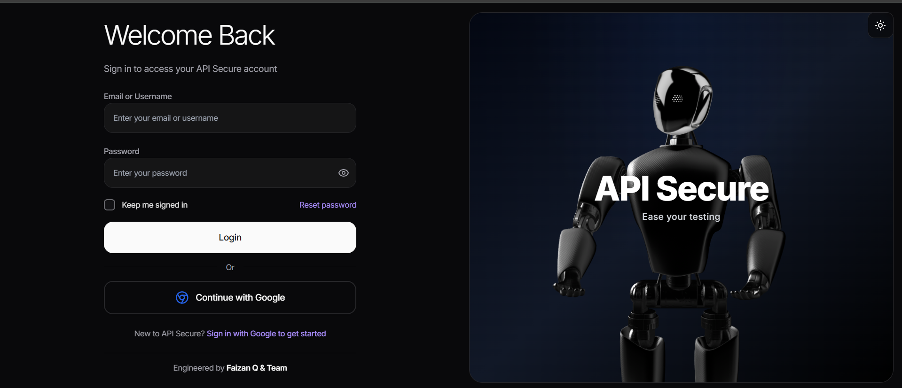
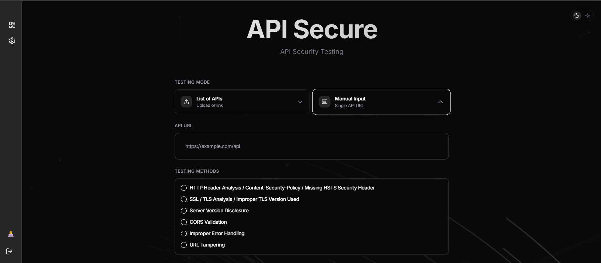
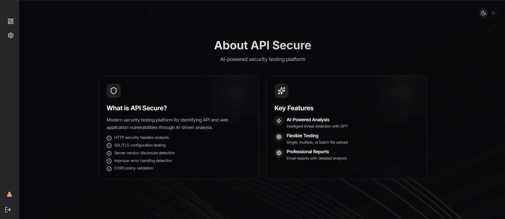

# 🛡️ API Secure - API Security Testing Platform

<div align="center">


**Modern API Security Testing Platform with AI-Powered Analysis**

[](https://reactjs.org/)
[](https://www.typescriptlang.org/)
[](https://firebase.google.com/)
[](https://vitejs.dev/)

</div>

---

## 📋 Table of Contents

- [Overview](#-overview)
- [Screenshots](#-screenshots)
- [Features](#-features)
- [Security Tests](#-security-tests)
- [Quick Start](#-quick-start)
- [Tech Stack](#-tech-stack)
- [Contributing](#-contributing)
- [License](#-license)

---

## 🎯 Overview

**API Secure** is a comprehensive web-based security testing platform that analyzes APIs and websites for common vulnerabilities. It leverages AI-powered analysis through n8n automation workflows to provide detailed security reports via email.

---

## 📸 Screenshots

### Login Page

*Welcome back screen with email/password and Google Sign-In authentication options*

### Dashboard

*Main testing interface showing API URL input, testing mode selection, and security test options*

### About Page

*Platform overview featuring AI-powered analysis capabilities and key features*

---

## ✨ Features

- 🔐 **Secure Authentication** - Firebase Auth with Google Sign-In and email/password
- 🤖 **AI-Powered Analysis** - Intelligent vulnerability detection using Google Gemini AI
- 📧 **Email Reports** - Automated security reports sent via Gmail integration
- 📊 **Detailed Reports** - Comprehensive HTML reports with severity ratings and recommendations
- 🌐 **Multiple Input Methods** - Single URL, multiple URLs, or Excel file upload
- 💾 **Session Persistence** - Stay logged in across browser sessions
- 🎨 **Modern UI** - Beautiful, responsive design with dark/light mode toggle

---

## 🔍 Security Tests

API Secure offers the following security tests:

| Test | Description |
|------|-------------|
| **HTTP Header Analysis** | Content-Security-Policy validation, Missing HSTS Security Header detection |
| **SSL / TLS Analysis** | Certificate validation, Improper TLS Version Used detection |
| **Server Version Disclosure** | Stack detection and version information exposure |
| **CORS Validation** | Passive and active CORS misconfiguration detection |
| **Improper Error Handling** | Stack trace exposure and sensitive information detection |
| **URL Tampering Analysis** | Parameter manipulation, SQL/Command Injection testing |

---

## 🚀 Quick Start

### Prerequisites

- Node.js (v18 or higher)
- npm or yarn
- Firebase Project (for authentication)
- Supabase Project (for database)
- n8n Instance (for workflow automation)

### Installation

1. **Clone the repository**
   ```bash
   git clone https://github.com/your-username/api-secure.git
   cd api-secure
   ```

2. **Install dependencies**
   ```bash
   npm install
   ```

3. **Configure environment variables**
   
   Create a `.env` file in the root directory:
```env
   # Firebase Configuration
   VITE_FIREBASE_API_KEY=your_api_key
   VITE_FIREBASE_AUTH_DOMAIN=your_project.firebaseapp.com
   VITE_FIREBASE_PROJECT_ID=your_project_id
   VITE_FIREBASE_STORAGE_BUCKET=your_project.appspot.com
   VITE_FIREBASE_MESSAGING_SENDER_ID=your_sender_id
   VITE_FIREBASE_APP_ID=your_app_id

   # Supabase Configuration
VITE_SUPABASE_URL=https://your-project.supabase.co
   VITE_SUPABASE_ANON_KEY=your_anon_key

   # n8n Configuration
   VITE_N8N_WEBHOOK_URL=https://your-n8n-instance/webhook/endpoint
   ```

4. **Start development server**
```bash
   npm run dev
   ```

   The application will be available at `http://localhost:5173`

### Usage

1. **Login** - Sign in with Google or email/password
2. **Select Test** - Choose a security test type
3. **Enter URL** - Input the target URL(s)
4. **Add Recipients** - Enter email addresses for reports
5. **Run Test** - Click "Run Security Test"
6. **View Results** - Check your email for the detailed report

---

## 🛠️ Tech Stack

### Frontend
- **React 19** - UI Library
- **TypeScript** - Type Safety
- **Vite** - Build Tool
- **Tailwind CSS** - Styling
- **Framer Motion** - Animations
- **Radix UI** - Accessible Components

### Backend & Services
- **Firebase** - Authentication
- **Supabase** - Database & User Profiles
- **n8n** - Workflow Automation
- **Google Gemini AI** - Security Analysis

---

## 🤝 Contributing

Contributions are welcome! Please follow these steps:

1. Fork the repository
2. Create a feature branch (`git checkout -b feature/amazing-feature`)
3. Commit your changes (`git commit -m 'Add amazing feature'`)
4. Push to the branch (`git push origin feature/amazing-feature`)
5. Open a Pull Request

For more details, see [CONTRIBUTING.md](.github/CONTRIBUTING.md)

---

## 📄 License

This project is licensed under the MIT License - see the [LICENSE](LICENSE) file for details.

---

## 👥 Authors

- **API Secure Team** - *Development & Maintenance*

---

<div align="center">

**Built with -API Secure Team**

[Report Bug](https://github.com/your-username/api-secure/issues) · [Request Feature](https://github.com/your-username/api-secure/issues)

</div>
